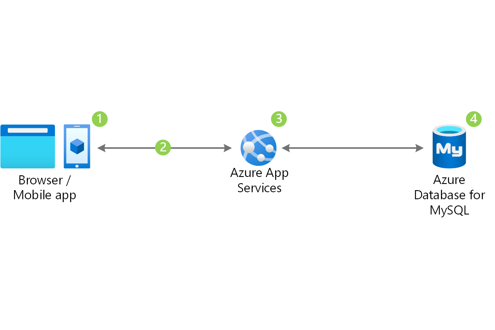

# Build A CI/CD Pipeline Using Azure DevOps for Terraform Cloud

## Introduction

This project is a simple example of how to build a CI/CD pipeline using Azure DevOps for Terraform Cloud. The pipeline will be triggered when a new commit is pushed to the repository. The pipeline will run the Terraform plan and apply commands to deploy the infrastructure to the cloud.

## Prerequisites

- Azure DevOps account
- Terraform Cloud account
- Azure subscription

## Usefull Links

- [Azure DevOps](https://dev.azure.com/)
- [Terraform Cloud](https://app.terraform.io/)
- [Azure Portal](https://portal.azure.com/)
- [Terraform](https://www.terraform.io/)

What do you need to crate from Terraform is using the following diagram and use Azure DevOps to store the Terraform code and use Terraform Cloud to deploy the infrastructure to Azure.

You can use Terraform documentation to create the manifests and use Terraform cloud documentation to create the workspace and connect it to Azure DevOps.

## Steps

1. Create a new project in Azure DevOps
2. Create a new repository in Azure DevOps
3. Clone the repository to your local machine
4. Create a new Terraform configuration file
5. Create a new Terraform Cloud workspace
6. Create A connection between Azure DevOps and Terraform Cloud
