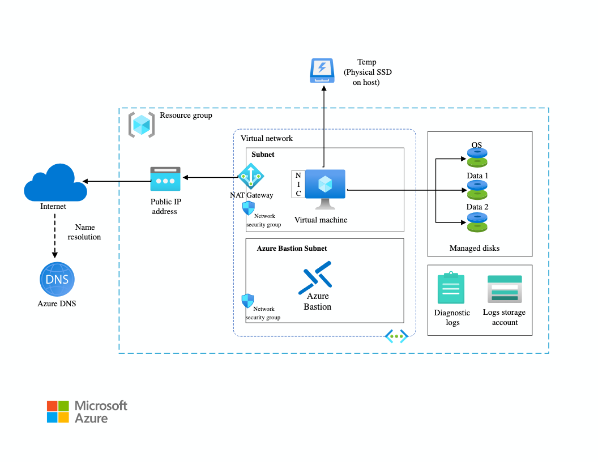

# Project- 1 Create Windows VM via Terraform

## Step-01: Introduction

In this project, we are going to create a Windows Virtual Machine in Azure using Terraform. For this project, we are going to use the below Azure Resources.

1. Resource Group
2. Virtual Network
3. Subnet
4. Network Security Group
5. Network Interface
6. Public IP
7. Virtual Machine
8. Bastion Host (Optional)
9. Azure Disks (OS Disk and Data Disk)
10. Blob Storage for Diagnostic Logs

## Step-02: Pre-requisites

1. Azure Subscription
2. Azure CLI
3. Visual Studio Code
4. Terraform
5. Git

Following is the high level architecture of the project.

For more details, please refer the below following URL.

[Create Windows VM via Terraform](https://learn.microsoft.com/en-us/azure/architecture/reference-architectures/n-tier/windows-vm)

No need to provision the Azure DNS

You will find the completed code in this folder under the answers folder.

